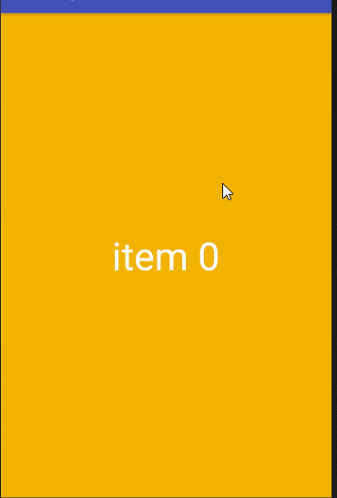
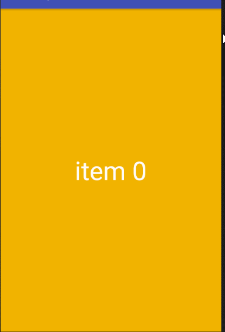
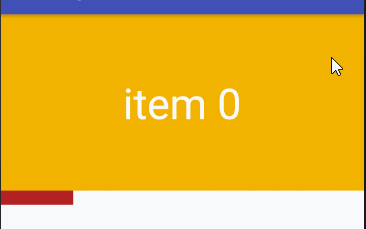
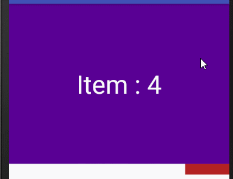
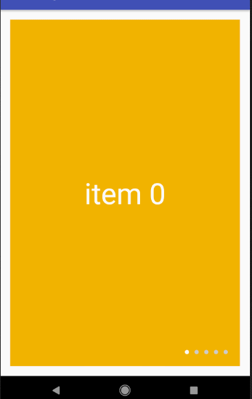
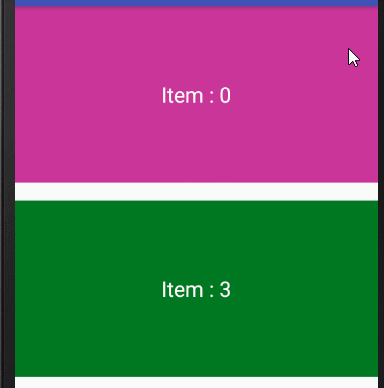
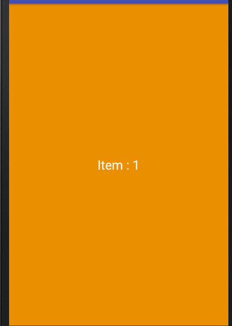

## Pager 工具集

### 引入

**Step 1.** Add the JitPack repository to your build file

Add it in your root build.gradle at the end of repositories:

```
	allprojects {
		repositories {
			...
			maven { url 'https://jitpack.io' }
		}
	}
```

**Step 2.** Add the dependency

```
	dependencies {
	        implementation 'com.github.threekilogram:PagerExtend:1.1.1'
	}
```

### BasePagerAdapter

> 简化PagerAdapter使用,使其增加view复用,自动响应数据变化

```
private class FragmentAdapter extends BasePagerAdapter<String, TextView> {
      private int[] mBackGround = {
          getResources().getColor( R.color.orange ),
          getResources().getColor( R.color.red ),
          getResources().getColor( R.color.green ),
          getResources().getColor( R.color.purple ),
          getResources().getColor( R.color.black )
      };
      @Override
      public int getCount ( ) {
            return 5;
      }
      @Override
      protected String getData ( int position ) {
            return "item " + position;
      }
      @Override
      protected TextView getView ( ViewGroup container, int position ) {
            TextView textView = new TextView( container.getContext() );
            textView.setTextSize( TypedValue.COMPLEX_UNIT_DIP, 48 );
            textView.setGravity( Gravity.CENTER );
            textView.setTextColor( Color.WHITE );
            return textView;
      }
      @Override
      protected void bindData ( int position, String data, TextView view ) {
            view.setText( data );
            view.setBackgroundColor( mBackGround[ position ] );
      }
}
```

```
mViewPager.setAdapter( new FragmentAdapter() );
```



### BaseTypePagerAdapter

> ViewPager多类型item Adapter

```
private class FragmentAdapter extends BaseTypePagerAdapter {
      
      private int[] mBackGround = {
          getResources().getColor( R.color.orange ),
          getResources().getColor( R.color.red ),
          getResources().getColor( R.color.green ),
          getResources().getColor( R.color.purple ),
          getResources().getColor( R.color.black )
      };
      
      private int[] mPictures = {
          R.drawable.c130,
          R.drawable.c274,
          R.drawable.c465
      };
      
      @Override
      public int getCount ( ) {
            return 8;
      }
      @Override
      protected int getViewType ( int position ) {
            if( position < 5 ) {
                  return 0;
            } else {
                  return 1;
            }
      }
      @Override
      protected Object getData ( int position, int type ) {
            if( position < 5 ) {
                  return "item " + position;
            }
            return null;
      }
      @Override
      protected View getView ( ViewGroup container, int position, int type ) {
            if( position < 5 ) {
                  TextView textView = new TextView( container.getContext() );
                  textView.setTextSize( TypedValue.COMPLEX_UNIT_DIP, 48 );
                  textView.setGravity( Gravity.CENTER );
                  textView.setTextColor( Color.WHITE );
                  return textView;
            } else {
                  ImageView imageView = new ImageView( container.getContext() );
                  imageView.setScaleType( ScaleType.CENTER_INSIDE );
                  return imageView;
            }
      }
      @Override
      protected void bindData ( int position, Object data, View view, int type ) {
            if( position < 5 ) {
                  ( (TextView) view ).setText( (String) data );
                  view.setBackgroundColor( mBackGround[ position ] );
            } else {
                  ( (ImageView) view ).setImageResource( mPictures[ position - 5 ] );
            }
      }
}
```

```
mViewPager.setAdapter( new FragmentAdapter() );
```




### ViewPagerScroll

> 扩展ViewPager.OnPageChangeListener使其可以观察当前条目和下一个条目滚动方向及进度

```
final ViewPagerScroll viewPagerScroll = new ViewPagerScroll( mViewPager );
viewPagerScroll.setOnPagerScrollListener( new OnViewPagerScrollListener() {
      @Override
      public void onScroll (
          int state, int currentPosition, int nextPosition, float offset ) {
            mIndicator.setXOff( currentPosition, -offset );
      }
      @Override
      public void onPageSelected ( int prevSelected, int newSelected ) {
      }
} );
```




## RecyclerPagerScroll

```
RecyclerPagerScroll listener = new RecyclerPagerScroll( mRecycler );
listener.setOnRecyclerPagerScrollListener( new OnRecyclerPagerScrollListener() {
      @Override
      public void onScroll (
          int state, int currentPosition, int nextPosition, int offsetX, int offsetY ) {
            mIndicator.setXOff( currentPosition, offsetX * 1f / mRecycler.getWidth() );
      }
      @Override
      public void onPageSelected ( int prevSelected, int newSelected ) {
      }
} );
```




### ViewBannerView

> 实际是LoopHandlerLayout,封装了了一个ViewPager在里面,定时执行轮播

```
<tech.threekilogram.pager.banner.ViewPagerBanner
    xmlns:android="http://schemas.android.com/apk/res/android"
    android:id="@+id/banner"
    android:layout_width="match_parent"
    android:layout_height="match_parent"
    android:padding="16dp"
    >

</tech.threekilogram.pager.banner.ViewPagerBanner>
```

```
mBanner.setBannerAdapter( new FragmentAdapter() );
```

* 控制轮播

```
mBanner.startLoop(); //开始轮播
mBanner.stopLoop(); //结束轮播
```

* 增加滚动时间

```
mBanner.addScrollDuration( 500 );
```

* 设置页间距

```
mBanner.setPageMargin( TypedValue.COMPLEX_UNIT_DIP, 16 );
```

* 设置指示器

```
DotView dotView = new DotView( getContext() );
dotView.setupWithBanner( mBanner, Gravity.BOTTOM | Gravity.END, 50 );
```




## RecyclerPager

> 使用RecyclerView实现的ViewPager,不会重新布局,可以设置方向

```
mRecyclerPager.setAdapter( new RecyclerAdapter() );
```




## RecyclerPagerBanner

> 使用RecyclerPagerBanner实现的Banner

```
<tech.threekilogram.pager.banner.RecyclerPagerBanner
    android:id="@+id/recyclerBanner"
    android:layout_width="match_parent"
    android:layout_height="match_parent">
</tech.threekilogram.pager.banner.RecyclerPagerBanner>
```

```
mRecyclerBanner.setBannerAdapter( new RecyclerAdapter() );
```

```
private class RecyclerAdapter extends BannerAdapter<Holder> {
      @Override
      public int getActualCount ( ) {
            return 5;
      }
      @NonNull
      @Override
      public Holder onCreateViewHolder ( @NonNull ViewGroup parent, int viewType ) {
            LayoutInflater inflater = LayoutInflater.from( parent.getContext() );
            View view = inflater.inflate( R.layout.item_recycler_pager, parent, false );
            return new Holder( view );
      }
      @Override
      public void onBindViewHolder (
          @NonNull Holder holder, int position ) {
            holder.bind( getActualPosition( position ) );
      }
}
```

```
mRecyclerBanner.startLoop();
mRecyclerBanner.stopLoop();
```



