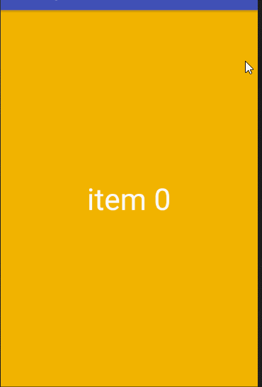

## ViewPager 工具集

### BasePagerAdapter

> 简化PagerAdapter使用,使其增加view复用,自动响应数据变化,更易读

```
private class FragmentAdapter extends BasePagerAdapter<String, TextView> {
      private int[] mBackGround = {
          getResources().getColor( R.color.orange ),
          getResources().getColor( R.color.red ),
          getResources().getColor( R.color.green ),
          getResources().getColor( R.color.purple ),
          getResources().getColor( R.color.black )
      };
      @Override
      public int getCount ( ) {
            return 5;
      }
      @Override
      protected String getData ( int position ) {
            return "item " + position;
      }
      @Override
      protected TextView getView ( ViewGroup container, int position ) {
            TextView textView = new TextView( container.getContext() );
            textView.setTextSize( TypedValue.COMPLEX_UNIT_DIP, 48 );
            textView.setGravity( Gravity.CENTER );
            textView.setTextColor( Color.WHITE );
            return textView;
      }
      @Override
      protected void bindData ( int position, String data, TextView view ) {
            view.setText( data );
            view.setBackgroundColor( mBackGround[ position ] );
      }
}
```

```
mViewPager.setAdapter( new FragmentAdapter() );
```


### BaseTypePagerAdapter

> ViewPager多类型item Adapter

```
private class FragmentAdapter extends BaseTypePagerAdapter {
      
      private int[] mBackGround = {
          getResources().getColor( R.color.orange ),
          getResources().getColor( R.color.red ),
          getResources().getColor( R.color.green ),
          getResources().getColor( R.color.purple ),
          getResources().getColor( R.color.black )
      };
      
      private int[] mPictures = {
          R.drawable.c130,
          R.drawable.c274,
          R.drawable.c465
      };
      
      @Override
      public int getCount ( ) {
            return 8;
      }
      @Override
      protected int getViewType ( int position ) {
            if( position < 5 ) {
                  return 0;
            } else {
                  return 1;
            }
      }
      @Override
      protected Object getData ( int position, int type ) {
            if( position < 5 ) {
                  return "item " + position;
            }
            return null;
      }
      @Override
      protected View getView ( ViewGroup container, int position, int type ) {
            if( position < 5 ) {
                  TextView textView = new TextView( container.getContext() );
                  textView.setTextSize( TypedValue.COMPLEX_UNIT_DIP, 48 );
                  textView.setGravity( Gravity.CENTER );
                  textView.setTextColor( Color.WHITE );
                  return textView;
            } else {
                  ImageView imageView = new ImageView( container.getContext() );
                  imageView.setScaleType( ScaleType.CENTER_INSIDE );
                  return imageView;
            }
      }
      @Override
      protected void bindData ( int position, Object data, View view, int type ) {
            if( position < 5 ) {
                  ( (TextView) view ).setText( (String) data );
                  view.setBackgroundColor( mBackGround[ position ] );
            } else {
                  ( (ImageView) view ).setImageResource( mPictures[ position - 5 ] );
            }
      }
}
```

```
mViewPager.setAdapter( new FragmentAdapter() );
```


### MaxCountAdapter

> 包装PagerAdapter使其可以返回无限多数据

```
MaxCountAdapter adapter = new MaxCountAdapter( new FragmentAdapter() );
mViewPager.setAdapter( adapter );
mViewPager.setCurrentItem( adapter.getStartPosition() );
```




### PagerScroll

> 扩展ViewPager.OnPageChangeListener使其可以观察当前条目和下一个条目滚动方向及进度

```
// 使用pager创建
PagerScroll pagerScroll = new PagerScroll( mViewPager );
pagerScroll.setOnPagerScrollListener( new OnPagerScrollListener() {
      @Override
      public void onCurrent ( int currentPosition, float offset ) {
      		// 当当前条目滚动时,修改进度条
            mIndicator.setXOff( currentPosition, -offset );
      }
      @Override
      public void onNext ( int nextPosition, float offset ) { }
      @Override
      public void onPageSelected ( int position ) { }
} );
```


### BannerView

> 实际是FrameLayout,只是封装了了一个ViewPager在里面作为轮播图

```
// 设置一个pagerAdapter就可以使用了
FragmentAdapter pagerAdapter = new FragmentAdapter();
mBanner.setPagerAdapter( pagerAdapter );
```

* 控制轮播

```
mBanner.startLoop(); //开始轮播
mBanner.stopLoop(); //结束轮播
```